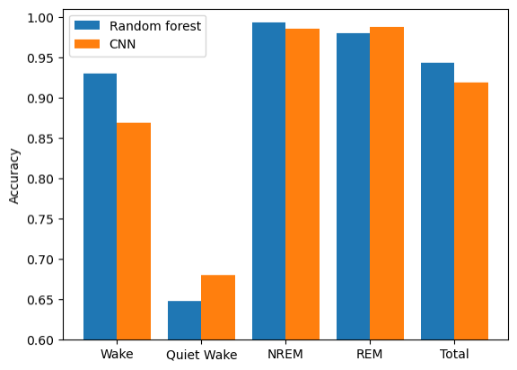

# Brain State classification using ML and AI 

## NON-TECHNICAL EXPLANATION OF YOUR PROJECT
Animals' behaviour can be segmented into different states. Behavioral states are strongly related to regimes of brain electrical activity, divided into four main categories: Wake (or active behaviour), Quiet Wake, Rapid Eye Movement (REM) sleep and non-REM sleep. Each brain state is associate with specific patterns of brain activity and behaviour. For example, REM sleep is when the most vivid dreams happen, whereas non-NREM sleep is mainly devoted to memory consolidation processes. Brain states affect, for example, how an animal responds to a sensory stimulus or how a given neuronal activity pattern affects memory processing. 
To interpret cognitive responses, it is critical to identify the ongoing brain state. However, this task can be very time consuming, and be affected by subjective judjements or by too simplistic automatic detection methods. In this project I explore two supervised stratefies to classify brain states using machine learning and AI.

## DATA
Data was collected from electrophysiological recordings of brain activity and behaviour in freely-moving mice. Brain electrical signals were recorded from micro-wire bundles implanted in the hippocampus. Behavioral data was collected from an accelerometer incorporated in the head-stage pre-amplifier of the electrophysiological setup. Since the head-stage was connected to the implant during recordings, the accelerometer captures the head movements (instantaneous accelerations).

Each instance, representing a time point where the brain state has to be classified, contains two types of inputs:
- A power spectrogram of the local field potential (LFP, representing local electrical actifity) around the time point to classify (+- 50 s).
- A segment of the movement magnitude time series, extracted from an accelerometer on the mouse head.
Each brain state is associated with a particular combination of patterns of LFP power and movement, allowing classification (please check examples in the provided notebook).

## MODEL 
I tested two models. The first was a popular decision tree-based algorithm named Random Forest. 
Then I designed a custom bimodal Concolutional Neural Network. The 2 types of inputs pass though independent convolutional branches, each composed by 2 convolutional layers (2D for LFP spectrograms branch or 1D for movement branch), after which their output is concatenated and fed into 2 fully connected layers before reching the output layer.
I chose/designed these models because they don't use distance-based metrics and they are robust to different scales of features, which is important considering this bimodal data with different formats. I also intended to test the difference in performance between a commonly used ML model and a more complex custom-designed neural network.

## HYPERPARAMETER OPTIMSATION
Given the size of the dataset and the relative complexity of the CNN model, it becomes too computationally expensive to optimise hyperparameters using grid search, and random search provides limited performance. So, I used Bayesian Optimization to speed-up the search of local maxima. I used a state-of-the-art award winning algorithm developed by a HUAWEI team termed Heteroscedastic Evolutionary Bayesian Optimisation (HEBO). It improves the standard BO by assuming non-stationarity and complex amplitude-dependent noise of the black-box function (for details please check the package repository under https://github.com/huawei-noah/HEBO/tree/master/HEBO).

## RESULTS
Overall, the performance of both models was quite decent, with the accuracy of the bimodal CNN being slightly higher than that of the Random Forest. Notably, the CNN performed considerably better on classifying quiet wake states than the Random Forest (almost 10% difference). This might be related with the capacity of CNNs to extract important features from images.

Importantly, the distinction between the quiet wake and NREM sleep states is not straightforward even for a human expert. This is likely to introduce uncertainty in the labeling and suggests that the performance of the CNN model is close to a human expert, considering the inputs provided.

